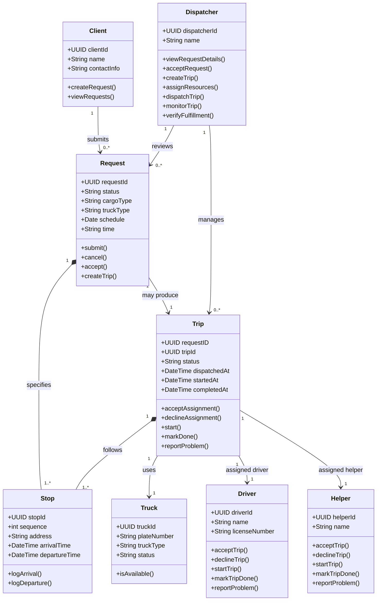

# FleetMan

A logistics services management system with a web app dashboard and an offline-first mobile app for drivers and helpers.

# Key Features

- **Analytics Dashboard** - Displays key statistics and information about daily operations
- **Interactive Kanban Board** - A Kanban-style board for dynamically managing workload
- **Client Portal** - A business-to-business portal where clients can directly request for the company's services
- **Offline-first Mobile App** - A mobile app specialized for offline operations serving drivers and helpers

## Definitions

**Client** - A person or entity requesting the service of the logistics company
**Dispatcher** - Handles requests from clients and dispatches trucks
**Request** - The service being requested from the logistics company (Intent)
**Trip** - The request itself carried out (Execution)
**Truck** - A vehicle used to transport the cargo of the clients
**Driver** - The person in charge of driving the truck to and from its destinations
**Helper** - The assistant to the driver and main handler of the cargo

# Stories

## Client Story

As a client
I want to avail the company's services and specify details such as stops, cargo type, truck type, time and schedule
So that I can bring our cargo to our locations

**Acceptance Criteria**
- Client can access the request portal
- Client can input details such as stops, cargo type, truck type, time and schedule
- Client can request more than one service
- Requests can be viewed and handled by dispatcher

## Dispatcher Story

As a dispatcher
I want to see requests, accept them, handle them by assigning a truck, driver, and helper, provide them the details of the request and dispatch/deploy them
So that client requests are fulfilled

**Acceptance Criteria**
- Dispatcher can receive and see client requests in the dashboard
- Dispatcher can view request details
- Dispatcher can create a trip out of a request
- Dispatcher can assign a truck, driver and helper for a trip
- Dispatcher can monitor each trip's progress
- Dispatcher can verify request has been fulfilled
- Drivers and helpers are notified of their assignment

## Driver and Helper Story

As a driver/helper
I want to be assigned a request, read the requests' details such as stops, cargo type, truck type, time and schedule, log the time of arrival and departure from and at the stops and report any problems to dispatch
So that I can deliver the cargo in time and in good condition

**Acceptance Criteria**
- Both can receive and see trip assignment
- Both can view trip assignment details
- Both can accept or decline a trip assignment
- Both can start a trip assignment
- Both can log time of arrival and departure between stops
- Both can mark a trip assignment done

## UML diagrams

### Core Domain Diagram

# Low-Level Approach

Technical details that explains key concepts in the software architecture level.

## Tech Stack

**Web Frontend**
- NextJS (Framework)
- TailwindCSS to build and design quickly
- shadcn for out-of-the-box components
- tanstack-react-query to manage server state, caching and background refetching
- react-hook-form for form state management
- zod for schema validation
- supabasejs (official supabase client)
- Lucide for icons

**Supabase as BaaS**

- PostgreSQL Engine
- PostGIS for handling geographic points, stop address coordinates and geofencing. 
- pgcrypto for for generating auto-formatted `UUIDv4` identifiers across all primary keys
- Supabase Auth for authentication and session management
- Row Level Security for native security policies applied directly at the database layer
- Supabase Realtime Listens to Postgres Write-Ahead Logs (WAL) over WebSockets.
- Supabase Storage to upload proof of delivery and documents

**Offline-first Mobile App**

- React Native as the framework
- expo as the native toolchain for device APIs
- powersync as local first engine that directly connects to Supabase
- powersync/op-sqlite under the hood as its high-performance local SQLite engine on the device
- expo-router
- expo-camera for photo uploads
- expo-location to auto attach location in photo uploads
- Lucide for React Native
- zod for schema validation
- supabasejs

